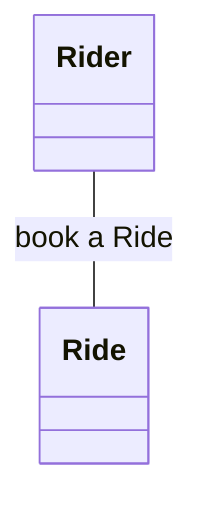
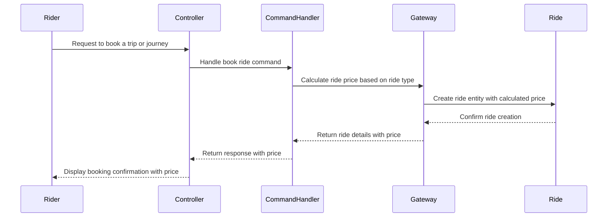

---

# UberWeal SAAS Exercise

## Overview

UberWeal SAAS is a ride-hailing application that allows Riders to request drivers for their journeys. The application calculates the ride price based on the nature of the journey and deducts the corresponding funds from the Rider's account.

## User Stories

### Book a Driver

As a Rider, I want to book a Driver that can take me to my destination, providing an efficient alternative to public transport.

### List all my past races

As a Rider, I would like to list all the history of my races with mention of the respective Drivers, enabling me to track my ride history.

## Pricing Rules

- For a trip from Paris to the outside world, the price is 30 euros.
- For a journey from outside to Paris, the price is 0 euro.
- For a journey within the city walls, the price is 10 euros.
- For a trip outside Paris, the price is 50 euros.
- In the first year of use, a Rider pays half the price of the ride.
- If the price was 0€, then a voucher is considered, valid for the next ride.
- If the number of kilometers is less than 5 km, there is a 5-euro discount.

## System Overview

### Class Hierarchy


### Sequence Diagram

## Implementation Details

### Project Structure

The project follows the Clean Architecture principles with the following structure:

```
src
├── main
│   ├── java
│   │   └── com.samir.uberweal
│   │       ├── config
│   │       ├── adapters
│   │       │   ├── controllers
│   │       │   ├── dtos
│   │       │   ├── gateways
│   │       │   └── presenters
│   │       ├── application
│   │       │   ├── command
│   │       │   │   ├── commands
│   │       │   │   └── handlers
│   │       │   │
│   │       │   └── query
│   │       │       ├── queries
│   │       │       └── handlers
│   │       ├── domain
│   │       │   ├── entities
│   │       │   ├── exceptions
│   │       │   ├── gateways
│   │       │   └── observers
│   │       │   └── services
│   │       │       └── pricing
│   │       └── infrastructure
│   │           ├── jpa
│   │           │   ├── entities
│   │           │   └── repositories
│   │           └── repositories
│   └── resources
└── test
    └── java
        └── com.samir.uberweal
            └── application
                └── command
                    └── handlers
```

Certainly! Here's the updated folder structure description:

### Project Structure

The project follows the Clean Architecture principles, organizing code into distinct layers for improved maintainability and testability.

- **config:** Contains configuration classes for spring boot application.

- **adapters:**
  - **controllers:** Handles interactions with the user interface, specifically ride-related operations.
  - **dtos:** Data Transfer Objects used for transferring data between layers.
  - **gateways:** Implements interactions with external systems or services.
  - **presenters:** Classes related to presenting data or formatting output.

- **application:**
  - **command:**
    - **commands:** Defines command objects representing user requests.
    - **handlers:** Implements handlers for processing command-related operations.
  - **query:**
    - **queries:** Defines query objects representing user queries.
    - **handlers:** Implements handlers for processing query-related operations.

- **domain:**
  - **entities:** Contains classes representing core business entities like drivers, riders, and rides.
  - **exceptions:** Custom exception classes for handling specific scenarios.
  - **gateways:** Interfaces and stub implementations for interacting with external systems.
  - **observers:** Classes related to observing or reacting to specific events.
  - **services:**
    - **pricing:**
      - **calculator:** Classes for calculating ride charges.
      - **strategies:** Strategies for different pricing scenarios.

- **infrastructure:**
  - **jpa:**
    - **entities:** Classes for mapping data between Java objects and a relational database.
    - **repositories:** Interfaces for database interactions.
  - **repositories:** Implementations of data gateways for interacting with external systems.

## Dependencies

The project uses [Maven](https://maven.apache.org/) as the build tool.

## Maven Wrapper
### What is Maven Wrapper?

[Maven Wrapper](https://github.com/takari/maven-wrapper) is a mechanism that allows a Maven project to be built, executed, and developed with a predefined Maven version. This means users don't have to install Maven globally on their systems.

### Using Maven Without Installation

1. Navigate to the project's root directory in the terminal.

2. Run Maven commands using the wrapper. For example, to build and run the Spring project:
  - On Unix-based systems:
    ```bash
    ./mvnw spring-boot:run
    ```
  - On Windows:
    ```powershell
    .\mvnw.cmd spring-boot:run
    ```

   Alternatively, you can build and package the project into a JAR file and then run it using `java -jar`:
   ```bash
   ./mvnw clean package
   java -jar target/UberWeal-0.0.1-SNAPSHOT.jar
   ```

   On Windows:
   ```powershell
   .\mvnw.cmd clean package
   java -jar target\UberWeal-0.0.1-SNAPSHOT.jar
   ```

These commands use the Maven Wrapper (`mvnw` or `mvnw.cmd`) to build and run the Spring project. The `spring-boot:run` goal is specific to Spring Boot applications and simplifies the process by automatically packaging and running the application.

# Testing

Test cases are provided to ensure the correctness of the implemented use cases.

## Running the Tests

To run the tests using Maven, execute the following command:

```bash
./mvnw test
```

If you are on Windows, you can use the following command:

```powershell
.\mvnw.cmd test
```
---

